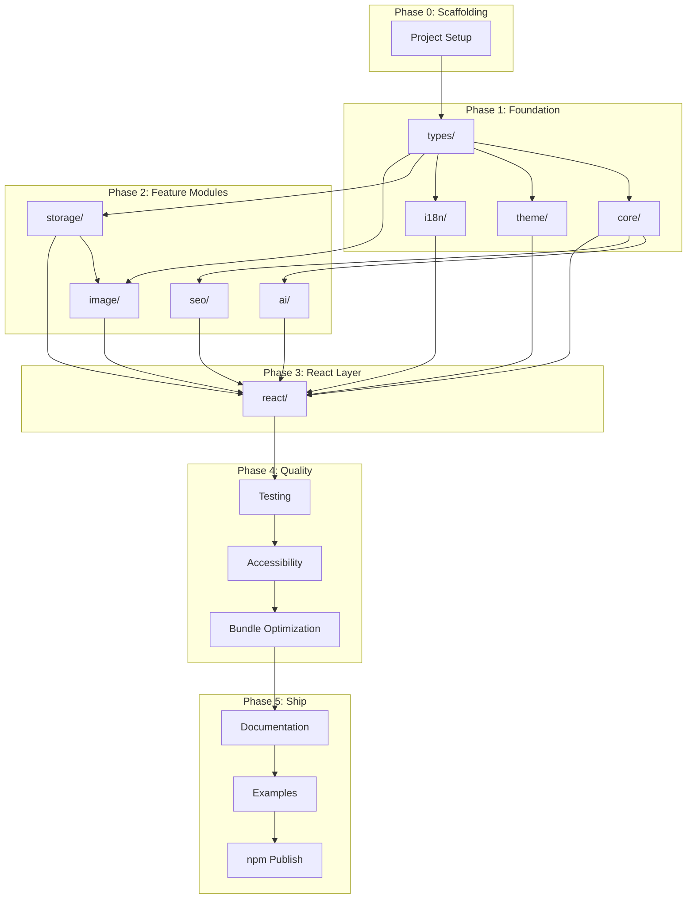
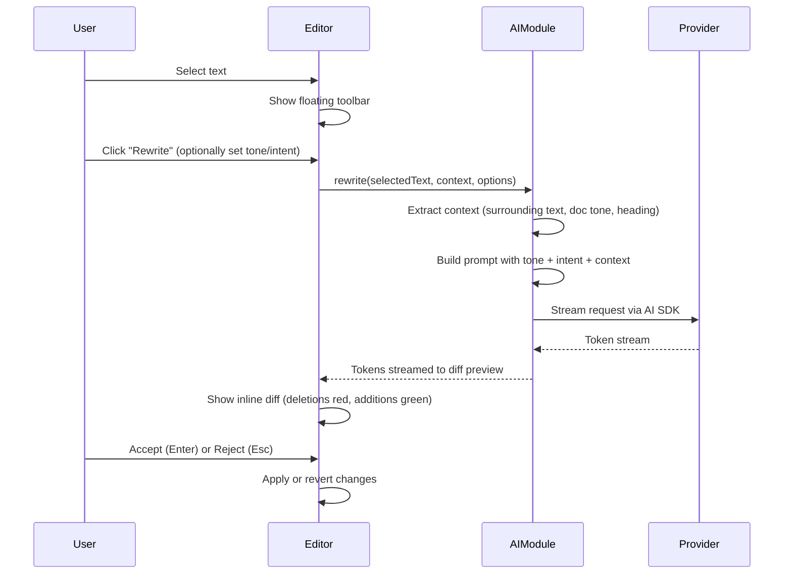
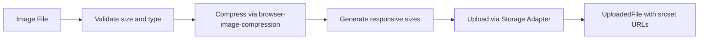
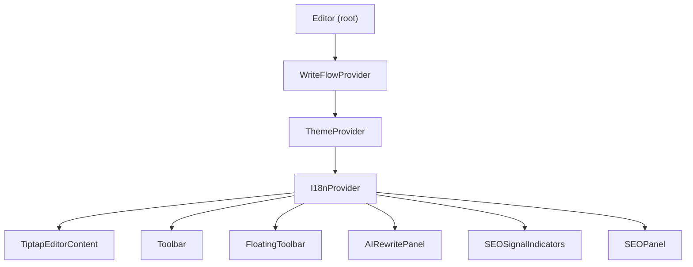

# WriteFlow — Complete Implementation Plan (A to Z)

> **Overview:** Build the entire `@writeflow/editor` package from scratch — a single npm package containing a Tiptap-based rich text editor with inline AI rewriting, progressive SEO signals, image optimization, BYO storage adapters, theming, and i18n — exposed as a typed React component and hooks API.

---

## Task Checklist

- [x] **Phase 0:** Project scaffolding — package.json, tsconfig, tsup, vitest, eslint, prettier, husky, directory structure, git init
- [x] **Phase 1a:** types/ module — all interfaces (EditorConfig, AIConfig, StorageConfig, SEOConfig, ThemeConfig, etc.)
- [x] **Phase 1b:** core/ module — Tiptap setup, WriteFlowKit extension bundle, createEditor factory, document model, serializers, event system
- [x] **Phase 1c:** theme/ module — CSS variables, 3 presets (default/minimal/editorial), auto-detection, dark mode, styles.css
- [x] **Phase 1d:** i18n/ module — default English strings (~60-80 keys), I18nProvider, useTranslation hook, locale formatting
- [x] **Phase 2a:** storage/ module — StorageAdapter interface, S3 adapter (presigned URL + direct mode), factory function
- [x] **Phase 2b:** image/ module — compression pipeline, responsive sizes, format detection, alt text suggestion, web worker offload
- [x] **Phase 2c:** ai/ module — provider factory, OpenAI+Anthropic adapters, rewrite engine, prompt templates, streaming, diff computation, context extraction
- [x] **Phase 2d:** seo/ module — light signals engine (4 rules), pre-publish analyzer, readability scoring, keyword analysis, SERP preview, scoring
- [x] **Phase 3a:** react/hooks/ — useEditor, useAIRewrite, useSEOAnalysis, useStorage, useTheme
- [x] **Phase 3b:** react/components/ — toolbar, floating toolbar, AI rewrite panel + diff view, AI options, SEO signals, SEO panel, SERP preview, image upload
- [x] **Phase 3c:** react/editor.tsx — main Editor component, WriteFlowProvider, wiring all modules together, barrel export in index.ts
- [x] **Phase 4a:** Testing — unit tests for all logic modules, component tests for all React components, integration tests for full flows
- [x] **Phase 4b:** Accessibility — ARIA labels, keyboard navigation, focus management, color contrast audit
- [x] **Phase 4c:** Performance — bundle size budget enforcement, lazy loading, debouncing, tree-shaking verification
- [x] **Phase 5a:** Documentation — getting-started, configuration, AI, SEO, storage, theming, i18n, hooks, Next.js, TypeScript guides
- [x] **Phase 5b:** Examples — react-basic, nextjs-app-router, nextjs-pages-router (each a working app)
- [x] **Phase 6:** CI/CD + Release — GitHub Actions workflow, npm publish config, CHANGELOG, version 0.1.0 release

---

## Dependency Graph (Build Order)



---

## Phase 0: Project Scaffolding

### 0.1 Initialize Package

- `npm init` with scope `@writeflow/editor`
- **package.json** key fields:

```json
{
  "name": "@writeflow/editor",
  "version": "0.1.0",
  "type": "module",
  "main": "./dist/index.cjs",
  "module": "./dist/index.js",
  "types": "./dist/index.d.ts",
  "exports": {
    ".": {
      "import": { "types": "./dist/index.d.ts", "default": "./dist/index.js" },
      "require": { "types": "./dist/index.d.cts", "default": "./dist/index.cjs" }
    },
    "./styles.css": "./dist/styles.css"
  },
  "sideEffects": ["*.css"],
  "files": ["dist", "README.md", "LICENSE"],
  "peerDependencies": {
    "react": "^18.0.0 || ^19.0.0",
    "react-dom": "^18.0.0 || ^19.0.0"
  }
}
```

### 0.2 TypeScript Configuration

- `tsconfig.json`: `strict: true`, `target: "ES2022"`, `moduleResolution: "bundler"`, `jsx: "react-jsx"`, `declaration: true`, `paths` aliases for internal modules (`@writeflow/core/*`, etc.)
- `tsconfig.build.json` extends base, excludes tests/examples

### 0.3 Build System — tsup

- **Why tsup**: esbuild-based, fast, handles CJS/ESM dual output, CSS extraction, declaration files
- `tsup.config.ts`:
  - Entry: `src/index.ts`
  - Format: `["esm", "cjs"]`
  - DTS: `true`
  - External: `react`, `react-dom`, `@tiptap/*`
  - CSS injection: extract to `styles.css`
  - Treeshake: `true`
  - Splitting: `true`

### 0.4 Linting and Formatting

- **ESLint**: `@typescript-eslint/eslint-plugin`, `eslint-plugin-react-hooks`, `eslint-plugin-react`
- **Prettier**: standard config, printWidth 100, singleQuote true
- `.eslintrc.cjs` with strict TypeScript rules, **no-explicit-any** as error
- `lint-staged` + `husky` for pre-commit hooks

### 0.5 Testing Framework

- **Vitest** for unit + integration tests
- **@testing-library/react** for component tests
- **jsdom** environment for DOM tests
- `vitest.config.ts` with path aliases matching tsconfig

### 0.6 Git Setup

- `.gitignore` (node_modules, dist, .env, coverage, .turbo)
- Conventional commits enforced via `commitlint`
- MIT `LICENSE` file

### 0.7 Directory Structure

```
writeflow/
  src/
    index.ts              # Public barrel export
    core/                 # Tiptap setup, extensions, document model
    ai/                   # Rewrite engine, provider abstraction
    seo/                  # Light signals, pre-publish analysis
    storage/              # Adapter interface, S3 implementation
    image/                # Compression, format conversion
    theme/                # CSS variables, auto-detection, presets
    i18n/                 # Translatable strings, locale formatting
    react/                # React components, hooks, context
    types/                # All shared type definitions
    utils/                # Shared utilities (debounce, etc.)
  tests/
    unit/
    integration/
    components/
  examples/
    react-basic/
    nextjs-app-router/
    nextjs-pages-router/
  docs/
  tsconfig.json
  tsup.config.ts
  vitest.config.ts
  package.json
```

### 0.8 Dependencies (exact list)

**Runtime:**
- `@tiptap/core`, `@tiptap/pm`, `@tiptap/starter-kit` — editor foundation
- `@tiptap/extension-placeholder`, `@tiptap/extension-image`, `@tiptap/extension-link`, `@tiptap/extension-heading`, `@tiptap/extension-highlight`, `@tiptap/extension-underline`, `@tiptap/extension-text-align`, `@tiptap/extension-color`, `@tiptap/extension-code-block-lowlight` — editor features
- `@tiptap/react` — React binding for Tiptap
- `ai` (Vercel AI SDK) — streaming AI responses, provider abstraction
- `@ai-sdk/openai`, `@ai-sdk/anthropic` — AI provider adapters
- `@aws-sdk/client-s3`, `@aws-sdk/s3-request-presigner` — S3 storage
- `browser-image-compression` — client-side image compression
- `turndown` — HTML to Markdown conversion
- `diff-match-patch` — text diff for rewrite preview

**Dev:**
- `tsup`, `typescript`, `vitest`, `@testing-library/react`, `@testing-library/jest-dom`, `jsdom`
- `eslint`, `@typescript-eslint/eslint-plugin`, `@typescript-eslint/parser`, `prettier`
- `husky`, `lint-staged`, `commitlint`

---

## Phase 1: Foundation Layer

### 1.1 `src/types/` — Type Definitions (the contract)

This module defines the public API surface. Every type from the README spec is implemented here. Zero `any`. This file is the single source of truth.

**Files:**

- `src/types/index.ts` — barrel export
- `src/types/editor.ts` — `EditorConfig`, `EditorContent`, `EditorInstance`
- `src/types/ai.ts` — `AIConfig`, `AIProvider`, `AITone`, `AIIntent`, `RewriteResult`, `RewriteOptions`, `AIProviderAdapter`
- `src/types/storage.ts` — `StorageConfig`, `StorageProvider`, `StorageAdapter`, `UploadedFile`, `PresignedUrlResponse`
- `src/types/seo.ts` — `SEOConfig`, `SEOAnalysis`, `SEOIssue`, `SEOSuggestion`, `SEOSignal`, `SEOSignalType`
- `src/types/theme.ts` — `ThemeConfig`, `ThemeMode`, `ThemeColors`, `ThemePreset`
- `src/types/i18n.ts` — `I18nConfig`, `Locale`, `TranslationKeys`
- `src/types/image.ts` — `ImageConfig`, `ImageProcessingResult`, `ImageFormat`
- `src/types/events.ts` — `EditorEvents`, `EditorEventMap` (typed event emitter)

**Key type: `StorageAdapter` interface**

```typescript
interface StorageAdapter {
  put(file: File, path: string): Promise<UploadedFile>;
  get(key: string): Promise<string>;
  delete(key: string): Promise<void>;
  list(prefix?: string): Promise<UploadedFile[]>;
  getPresignedUrl(key: string, options?: PresignedUrlOptions): Promise<string>;
}
```

**Key type: `AIProviderAdapter` interface**

```typescript
interface AIProviderAdapter {
  rewrite(params: RewriteParams): AsyncIterable<string>;
  restructure(params: RestructureParams): AsyncIterable<string>;
  suggestTitle(content: string): Promise<string[]>;
  suggestMeta(content: string): Promise<string>;
}
```

### 1.2 `src/core/` — Tiptap Editor Engine

The core editor setup with all extensions, document model, and event system.

**Files:**

- `src/core/index.ts` — barrel export
- `src/core/editor.ts` — `createEditor(config)` factory function returning configured Tiptap instance
- `src/core/extensions/index.ts` — extension bundle
- `src/core/extensions/writeflow-kit.ts` — custom StarterKit wrapper bundling all default extensions
- `src/core/extensions/ai-rewrite.ts` — custom Tiptap extension for tracking AI rewrite state (selection mark, pending rewrite decoration)
- `src/core/extensions/seo-signals.ts` — custom Tiptap extension that emits structural SEO events (missing H1, hierarchy breaks, empty alt text)
- `src/core/extensions/image-upload.ts` — custom Tiptap extension for handling image paste/drop/upload with automatic optimization
- `src/core/extensions/keyboard-shortcuts.ts` — custom shortcuts (Cmd+Shift+R for rewrite, etc.)
- `src/core/document.ts` — document model utilities: `getContent()` returning `EditorContent` (html, markdown, json, text, wordCount, readingTime)
- `src/core/events.ts` — typed event emitter wrapping Tiptap's event system
- `src/core/serializers.ts` — HTML-to-Markdown (via turndown), HTML-to-JSON, plain text extraction

**`createEditor` function detail:**

```typescript
function createEditor(config: EditorConfig): Editor {
  return new Editor({
    extensions: [
      WriteFlowKit,
      AIRewriteExtension.configure({ enabled: !!config.ai }),
      SEOSignalsExtension.configure({ enabled: config.seo?.lightSignals !== false }),
      ImageUploadExtension.configure({ storage: config.storage, image: config.image }),
    ],
    content: config.content?.html ?? '',
  });
}
```

**`getContent` function detail:**
- Extracts HTML from Tiptap
- Converts to Markdown via turndown
- Extracts JSON from Tiptap's `getJSON()`
- Computes `wordCount` (split on whitespace, filter empties)
- Computes `readingTime` (wordCount / 238 avg reading speed, ceil)

### 1.3 `src/theme/` — CSS Variable System

**Files:**

- `src/theme/index.ts` — barrel export
- `src/theme/variables.ts` — CSS variable name constants (`--wf-color-primary`, etc.)
- `src/theme/presets.ts` — three preset themes: `default`, `minimal`, `editorial`
- `src/theme/auto-detect.ts` — detects host app CSS variables, infers light/dark mode from `prefers-color-scheme` or host `[data-theme]` / `[class*="dark"]`
- `src/theme/apply.ts` — `applyTheme(config: ThemeConfig, container: HTMLElement)` sets CSS variables on the editor container
- `src/theme/styles.css` — base CSS using CSS variables for all colors, spacing, typography

**CSS variable naming convention:**
```css
--wf-color-primary, --wf-color-secondary, --wf-color-accent,
--wf-color-bg, --wf-color-fg, --wf-color-border, --wf-color-muted,
--wf-color-error, --wf-color-warning, --wf-color-success,
--wf-font-body, --wf-font-heading, --wf-font-mono,
--wf-radius-sm, --wf-radius-md, --wf-radius-lg,
--wf-space-1, --wf-space-2, ..., --wf-space-8
```

**Auto-detection algorithm:**
1. Check if host defines known CSS variables (common ones like `--color-primary`, `--background`, etc.)
2. Check `prefers-color-scheme` media query
3. Check `<html>` or `<body>` for `data-theme`, `class="dark"`, etc.
4. Apply detected mode, fall back to `default` preset

**Three presets:**
- `default` — clean, neutral (similar to Notion's editor feel)
- `minimal` — muted, reduced chrome, maximum focus on content
- `editorial` — more typographic, serif headings, editorial feel

### 1.4 `src/i18n/` — Internationalization

**Files:**

- `src/i18n/index.ts` — barrel export
- `src/i18n/strings.ts` — default English strings object (all UI labels, tooltips, ARIA labels)
- `src/i18n/context.ts` — `I18nProvider` and `useTranslation` hook
- `src/i18n/format.ts` — locale-aware number/date formatting

**Translation key structure (flat, namespaced):**
```typescript
const defaultStrings = {
  'toolbar.bold': 'Bold',
  'toolbar.italic': 'Italic',
  'toolbar.rewrite': 'Rewrite with AI',
  'ai.rewriting': 'Rewriting...',
  'ai.accept': 'Accept',
  'ai.reject': 'Reject',
  'ai.tone.formal': 'Formal',
  'ai.tone.casual': 'Casual',
  'ai.tone.persuasive': 'Persuasive',
  'ai.intent.simplify': 'Simplify',
  'ai.intent.expand': 'Expand',
  'ai.intent.clarify': 'Clarify',
  'seo.missingH1': 'Missing H1 heading',
  'seo.headingHierarchy': 'Heading hierarchy break',
  'seo.emptyAlt': 'Image missing alt text',
  'seo.panel.title': 'Content Review',
  'seo.panel.publish': 'Publish',
  // ... ~60-80 total keys
} as const;
```

**Usage:** Developer passes `locale` + optional `translations` override object. Merged with defaults. All strings accessed via `t('key')` returning typed string.

---

## Phase 2: Feature Modules

### 2.1 `src/ai/` — AI Rewrite Engine

This is the most critical module — the spec says "this IS the product."

**Files:**

- `src/ai/index.ts` — barrel export
- `src/ai/provider.ts` — `AIProviderAdapter` factory: `createAIProvider(config: AIConfig): AIProviderAdapter`
- `src/ai/providers/openai.ts` — OpenAI adapter using Vercel AI SDK `@ai-sdk/openai`
- `src/ai/providers/anthropic.ts` — Anthropic adapter using `@ai-sdk/anthropic`
- `src/ai/rewrite.ts` — core rewrite logic: builds prompt, streams response, returns `RewriteResult`
- `src/ai/restructure.ts` — full article restructure logic
- `src/ai/prompts.ts` — all prompt templates (rewrite, restructure, title suggestion, meta suggestion)
- `src/ai/context.ts` — context extraction: surrounding paragraphs, document tone analysis, heading structure
- `src/ai/diff.ts` — diff computation between original and rewritten text (uses `diff-match-patch`)
- `src/ai/stream.ts` — streaming utilities: token-by-token accumulation, abort controller management

**Rewrite flow (detailed):**



**Prompt engineering (rewrite):**

```typescript
function buildRewritePrompt(params: {
  selectedText: string;
  surroundingBefore: string;
  surroundingAfter: string;
  tone: AITone;
  intent: AIIntent;
  preserveMeaning: boolean;
}): string {
  return `You are rewriting a section of text within a larger article.

CONTEXT BEFORE:
"""
${params.surroundingBefore}
"""

TEXT TO REWRITE:
"""
${params.selectedText}
"""

CONTEXT AFTER:
"""
${params.surroundingAfter}
"""

INSTRUCTIONS:
- Tone: ${params.tone}
- Intent: ${params.intent}
${params.preserveMeaning ? '- Preserve the original meaning exactly' : ''}
- Match the style of the surrounding text
- Return ONLY the rewritten text, no explanations

REWRITTEN TEXT:`;
}
```

**Context extraction (`src/ai/context.ts`):**
- `getSurroundingContext(editor, selection, windowSize=500)` — gets N chars before and after selection
- `getDocumentTone(editor)` — samples first 3 paragraphs to analyze tone
- `getHeadingStructure(editor)` — extracts heading tree for restructuring

**Diff computation (`src/ai/diff.ts`):**
- Uses `diff-match-patch` to compute character-level diffs
- Returns array of `DiffSegment { type: 'equal' | 'insert' | 'delete', text: string }`
- Used by the React diff preview component to render inline before/after

**Streaming (`src/ai/stream.ts`):**
- Wraps Vercel AI SDK `streamText()` for streaming
- Manages `AbortController` for cancellation (user clicks reject mid-stream)
- Accumulates tokens and re-computes diff in real-time (debounced to every 100ms for perf)

### 2.2 `src/seo/` — Progressive SEO Engine

**Files:**

- `src/seo/index.ts` — barrel export
- `src/seo/signals.ts` — light signals engine (Phase 1 writing signals)
- `src/seo/analyzer.ts` — full pre-publish analysis (Phase 2)
- `src/seo/rules/heading.ts` — heading hierarchy validation (H1 exists, no skips)
- `src/seo/rules/title.ts` — title quality (length 30-60 chars, not generic)
- `src/seo/rules/alt-text.ts` — image alt text check
- `src/seo/rules/readability.ts` — sentence length, paragraph density, reading level (Flesch-Kincaid)
- `src/seo/rules/keyword.ts` — keyword density, distribution across sections
- `src/seo/rules/meta.ts` — meta description suggestions
- `src/seo/scoring.ts` — overall SEO score computation (0-100)
- `src/seo/serp-preview.ts` — SERP preview data generation (title, description, URL)

**Light signals engine (`signals.ts`):**

Runs synchronously on document structure changes (no AI, no network). Emits signals via Tiptap extension events.

```typescript
interface SEOSignal {
  type: 'missing-h1' | 'weak-title' | 'heading-hierarchy' | 'empty-alt';
  severity: 'info' | 'warning';
  element?: { from: number; to: number }; // ProseMirror position
  message: string;
}

function computeLightSignals(doc: ProseMirrorNode): SEOSignal[] {
  // Traverse doc tree, check structural rules only
  // No content analysis, no AI, no perf cost
}
```

**Pre-publish analyzer (`analyzer.ts`):**

Runs when user triggers Phase 2 (clicks Publish/Review). Performs full content analysis.

```typescript
async function analyzeContent(
  editor: Editor,
  config: SEOConfig,
  aiProvider?: AIProviderAdapter
): Promise<SEOAnalysis> {
  const signals = computeLightSignals(editor.state.doc);
  const readability = analyzeReadability(editor.getText());
  const keywords = config.targetKeywords
    ? analyzeKeywords(editor.getText(), config.targetKeywords)
    : [];
  const titleSuggestions = aiProvider
    ? await aiProvider.suggestTitle(editor.getText())
    : [];
  const metaSuggestion = aiProvider
    ? await aiProvider.suggestMeta(editor.getText())
    : undefined;

  return {
    score: computeScore(signals, readability, keywords),
    issues: [...signals.map(toIssue), ...readability.issues, ...keywords.issues],
    suggestions: [...titleSuggestions.map(toSuggestion), ...metaSuggestion ? [metaSuggestion] : []],
  };
}
```

**Readability analysis (`readability.ts`):**
- Average sentence length (flag if > 25 words)
- Paragraph density (flag if > 5 sentences per paragraph)
- Flesch-Kincaid reading level computation
- All computed locally, no AI needed

**Keyword analysis (`keyword.ts`):**
- Density = keyword occurrences / total words
- Distribution: check keyword appears in title, first paragraph, at least one heading, evenly across body sections
- Over-optimization warning: density > 3%

### 2.3 `src/storage/` — BYOS Adapter System

**Files:**

- `src/storage/index.ts` — barrel export
- `src/storage/adapter.ts` — `StorageAdapter` interface (defined in types, implemented here)
- `src/storage/factory.ts` — `createStorageAdapter(config: StorageConfig): StorageAdapter`
- `src/storage/adapters/s3.ts` — S3-compatible adapter (AWS S3 + Cloudflare R2)
- `src/storage/adapters/gcs.ts` — Google Cloud Storage adapter (v0.1+ stretch)
- `src/storage/adapters/azure.ts` — Azure Blob adapter (v0.1+ stretch)
- `src/storage/presigned.ts` — presigned URL workflow (calls developer's backend endpoint)
- `src/storage/utils.ts` — path generation, MIME type detection, file validation

**S3 adapter detail:**

Two modes based on config:

1. **Presigned URL mode** (recommended, client-safe):
   - Editor calls `config.presignedUrlEndpoint` with `{ filename, contentType, size }`
   - Backend returns `{ uploadUrl, publicUrl, key }`
   - Editor PUTs file directly to presigned URL
   - No credentials in browser

2. **Direct mode** (server-side only):
   - Uses `@aws-sdk/client-s3` directly
   - Documented with warnings: "server-side only"
   - Works for API routes, server actions

```typescript
class S3StorageAdapter implements StorageAdapter {
  async put(file: File, path: string): Promise<UploadedFile> {
    if (this.config.presignedUrlEndpoint) {
      return this.uploadViaPresigned(file, path);
    }
    if (this.config.accessKeyId && this.config.secretAccessKey) {
      return this.uploadDirect(file, path);
    }
    throw new WriteFlowError('Storage not configured: provide presignedUrlEndpoint or credentials');
  }
  // ...
}
```

### 2.4 `src/image/` — Image Optimization

**Files:**

- `src/image/index.ts` — barrel export
- `src/image/compress.ts` — client-side compression using `browser-image-compression`
- `src/image/resize.ts` — responsive size generation (generate multiple widths: 480, 768, 1024, 1440)
- `src/image/format.ts` — format detection, WebP/AVIF support detection
- `src/image/pipeline.ts` — orchestrates: validate -> compress -> resize -> upload -> return URLs
- `src/image/alt-text.ts` — AI-powered alt text suggestion (uses AI provider if configured)

**Image pipeline flow:**



**Compression settings:**
- Max file size: 1MB (configurable)
- Max dimensions: 2400px width (configurable)
- Quality: 0.8 for JPEG, 0.85 for WebP
- Uses web worker via `browser-image-compression` to avoid blocking main thread

**Responsive sizes generated:**
- Original, 1440w, 1024w, 768w, 480w (skip sizes larger than original)
- Returns `srcset` string for the image element
- Lazy loading attribute added automatically

---

## Phase 3: React Integration Layer

### 3.1 `src/react/` — Components and Hooks

**Files:**

- `src/react/index.ts` — barrel export
- `src/react/context.ts` — `WriteFlowProvider` context (holds editor instance, AI provider, storage adapter, theme, i18n)
- `src/react/editor.tsx` — `<Editor />` main component
- `src/react/hooks/use-editor.ts` — `useEditor()` hook
- `src/react/hooks/use-ai-rewrite.ts` — `useAIRewrite()` hook
- `src/react/hooks/use-seo-analysis.ts` — `useSEOAnalysis()` hook
- `src/react/hooks/use-storage.ts` — `useStorage()` hook
- `src/react/hooks/use-theme.ts` — `useTheme()` hook
- `src/react/components/toolbar.tsx` — main formatting toolbar
- `src/react/components/floating-toolbar.tsx` — appears on text selection (AI rewrite trigger)
- `src/react/components/ai-rewrite-panel.tsx` — inline diff preview with accept/reject
- `src/react/components/ai-options.tsx` — tone/intent selector dropdown
- `src/react/components/seo-signals.tsx` — light signal indicators (gutter/inline)
- `src/react/components/seo-panel.tsx` — pre-publish analysis panel
- `src/react/components/serp-preview.tsx` — SERP preview component
- `src/react/components/image-upload.tsx` — image drop zone + progress indicator
- `src/react/components/diff-view.tsx` — inline diff renderer (highlights inserts/deletes)

### 3.2 `<Editor />` Component (the public API)

The main component. Accepts all config as props, wires everything together.

```typescript
interface EditorProps extends EditorConfig {
  className?: string;
  style?: React.CSSProperties;
  readOnly?: boolean;
  autoFocus?: boolean;
  placeholder?: string;
}
```

**Internal structure of `<Editor />`:**



**Component lifecycle:**

1. `Editor` mounts, creates Tiptap instance via `createEditor(config)`
2. Initializes AI provider (if `ai` config provided)
3. Initializes storage adapter (if `storage` config provided)
4. Applies theme (auto-detect or from config)
5. Loads i18n strings (default English + user overrides)
6. Renders Tiptap editor + toolbar + overlays
7. On text selection > 1 word: shows floating toolbar with "Rewrite" button
8. On rewrite: streams response, shows diff preview inline
9. On accept/reject: applies or reverts, hides panel
10. On publish trigger: runs full SEO analysis, shows panel
11. On change: debounced callback with full `EditorContent` object

### 3.3 Floating Toolbar (AI Trigger)

- Appears 300ms after text selection stabilizes (debounced)
- Positioned above or below selection using ProseMirror's `view.coordsAtPos()`
- Contains: "Rewrite" button (primary), tone/intent dropdown (secondary, collapsed by default)
- Click "Rewrite" -> starts AI rewrite with defaults
- Expand options -> choose tone (formal/casual/persuasive) and intent (simplify/expand/clarify)
- Dismisses on click outside, Esc, or selection change

### 3.4 AI Rewrite Panel (Diff Preview)

- Renders inline in the editor, replacing the selected text temporarily
- Shows streaming diff: red strikethrough for deletions, green highlight for insertions
- Real-time: diff updates token-by-token as streaming progresses
- Bottom bar: "Accept" (Enter), "Reject" (Esc), loading spinner during stream
- On Accept: replaces editor content with rewritten text via Tiptap transaction
- On Reject: restores original text, hides panel
- Performance: diff recomputation debounced to every 100ms during streaming

### 3.5 SEO Signal Indicators

- Rendered as decorations in the Tiptap editor via ProseMirror decorations
- Missing H1: small info icon in top gutter area
- Heading hierarchy break: faint color shift on the heading node (CSS class)
- Empty alt text: small badge overlaid on image block
- Weak title: dashed underline on H1 (CSS class)
- All use CSS variables for colors (respects theme)
- All removable by clicking and resolving the issue

### 3.6 SEO Pre-Publish Panel

- Slides in from the right as a sidebar panel (not a modal)
- Header: "Content Review" + overall score (0-100, color-coded)
- Sections: Issues (grouped by severity), Suggestions (each with "Apply" / "Dismiss" buttons)
- SERP preview at the bottom
- "Publish Anyway" button always available (non-blocking)
- Closes on publish or manual dismiss

### 3.7 Hooks API (Advanced Users)

Each hook is independent, composable, and fully typed.

- **`useEditor(config)`** — returns `{ editor, content, setContent, isEmpty }`
- **`useAIRewrite(editor, aiConfig)`** — returns `{ rewrite, isRewriting, result, accept, reject, abort }`
- **`useSEOAnalysis(editor, seoConfig)`** — returns `{ signals, analysis, runAnalysis, isAnalyzing, score }`
- **`useStorage(storageConfig)`** — returns `{ upload, isUploading, progress, lastUpload }`
- **`useTheme(themeConfig)`** — returns `{ mode, colors, setMode, applyPreset }`

---

## Phase 4: Quality and Polish

### 4.1 Testing Strategy

**Unit tests (target: 90% coverage on logic modules):**
- `src/types/` — type-level tests using `tsd` (compile-time type testing)
- `src/ai/prompts.ts` — prompt template output tests
- `src/ai/diff.ts` — diff computation correctness
- `src/ai/context.ts` — context extraction from mock editors
- `src/seo/rules/*.ts` — each rule tested with valid/invalid document fixtures
- `src/seo/scoring.ts` — score computation edge cases
- `src/storage/adapters/s3.ts` — mocked S3 client, presigned URL flow
- `src/image/compress.ts` — mocked compression
- `src/theme/auto-detect.ts` — mock DOM environments
- `src/i18n/` — string resolution, fallback behavior
- `src/core/document.ts` — content extraction, word count, reading time

**Component tests (using @testing-library/react):**
- `<Editor />` — renders, accepts props, fires onChange
- Floating toolbar — appears on selection, triggers rewrite
- Diff preview — renders diff correctly, accept/reject work
- SEO signals — display on structural issues, hide when resolved
- SEO panel — opens on publish trigger, shows issues/suggestions
- Image upload — drop zone, progress, completion

**Integration tests:**
- Full rewrite flow: select -> rewrite -> stream mock -> diff -> accept
- Full publish flow: write -> trigger publish -> SEO analysis -> panel -> publish
- Image upload flow: drop image -> compress -> upload mock -> inserted in editor
- Theme switching: light -> dark -> auto

### 4.2 Accessibility

- All interactive elements have ARIA labels (from i18n strings)
- Floating toolbar: `role="toolbar"`, `aria-label="AI writing tools"`
- SEO panel: `role="complementary"`, `aria-label="Content review"`
- Diff preview: `aria-live="polite"` for streaming updates
- Keyboard navigation: Tab through toolbar buttons, Enter to activate
- Accept/Reject: Enter and Esc shortcuts announced via `aria-keyshortcuts`
- Focus management: focus returns to editor after panel close
- Color contrast: all presets meet WCAG 2.1 AA

### 4.3 Performance Optimization

- **Bundle size budget**: < 150KB gzipped (excluding peer deps)
- Tree-shakeable: each module is independently importable if using hooks API
- AI streaming debounced diff at 100ms
- SEO light signals computed on `doc.change` event, debounced at 500ms
- Image compression in web worker (via browser-image-compression)
- Lazy load SEO panel code (dynamic import on first trigger)
- Lazy load AI modules if no `ai` config provided
- CSS: single `styles.css` file, no runtime CSS-in-JS

---

## Phase 5: Documentation and Examples

### 5.1 Documentation

- `docs/getting-started.md` — install, basic usage, 5-minute quickstart
- `docs/configuration.md` — all config options with examples
- `docs/ai.md` — AI provider setup, prompt customization, security (API key handling)
- `docs/seo.md` — light signals, pre-publish panel, keyword config
- `docs/storage.md` — S3 setup, presigned URLs, direct credentials warning
- `docs/theming.md` — presets, custom themes, CSS variables reference, dark mode
- `docs/i18n.md` — translation override, adding locales
- `docs/hooks.md` — hooks API for advanced usage
- `docs/nextjs.md` — App Router + Pages Router integration guide
- `docs/typescript.md` — type exports, generics, strict mode benefits

### 5.2 Examples

- **`examples/react-basic/`** — Create React App + WriteFlow, minimal setup
- **`examples/nextjs-app-router/`** — Next.js 15 App Router, server actions for publish, presigned URL API route
- **`examples/nextjs-pages-router/`** — Next.js Pages Router, API route for publish

Each example is a working app with:
- `package.json` with WriteFlow as local dependency (workspace link)
- Full typed config
- Working AI rewrite (requires user to add their OpenAI key via `.env`)
- Image upload to local filesystem (for demo)
- Dark mode toggle

---

## Phase 6: Build, CI/CD, and Release

### 6.1 Build Pipeline

```bash
# Full build
tsup src/index.ts --format esm,cjs --dts --external react --external react-dom

# Type check (no emit)
tsc --noEmit

# Lint
eslint src/ --ext .ts,.tsx

# Test
vitest run --coverage

# Size check
bundlesize --max-size 150kB
```

### 6.2 CI/CD (GitHub Actions)

- **On PR**: lint + type-check + test + build + bundle size check
- **On merge to main**: all above + publish to npm (if version bumped)
- **Matrix**: Node 20 + Node 22, React 18 + React 19

### 6.3 npm Publishing

- `npm publish --access public`
- Scoped under `@writeflow/editor`
- `prepublishOnly` script runs full build + test
- `.npmignore` or `files` field limits published content to `dist/`, `README.md`, `LICENSE`

### 6.4 Versioning

- Semantic versioning
- `0.1.0` for initial release
- CHANGELOG.md maintained per release

---

## Implementation Order (Critical Path)

The exact sequence to build, respecting dependencies:

1. **Project scaffolding** (package.json, tsconfig, tsup, vitest, eslint, directory structure)
2. **types/** (all interfaces — the contract everything builds against)
3. **core/** (Tiptap setup, extensions, document model, serializers)
4. **theme/** (CSS variables, presets, auto-detection — needed for visual development)
5. **i18n/** (string system — needed before building any UI)
6. **storage/** (S3 adapter — needed before image module)
7. **image/** (compression, pipeline — depends on storage)
8. **ai/** (provider abstraction, rewrite engine, prompts, diff, streaming)
9. **seo/** (light signals, pre-publish analyzer, rules)
10. **react/hooks/** (useEditor, useAIRewrite, useSEOAnalysis, useStorage, useTheme)
11. **react/components/** (toolbar, floating toolbar, diff view, SEO panel, image upload)
12. **react/editor.tsx** (main `<Editor />` component wiring everything together)
13. **Tests** (unit, component, integration)
14. **Accessibility audit and fixes**
15. **Performance and bundle size optimization**
16. **Documentation**
17. **Examples**
18. **CI/CD setup**
19. **npm publish preparation**

---

## Key Technical Decisions Summary

- **Build tool** — tsup: Fast, handles dual CJS/ESM, DTS generation, CSS extraction
- **Test framework** — Vitest: Fast, TypeScript-native, compatible with Testing Library
- **AI integration** — Vercel AI SDK: Streaming-first, multi-provider, maintained, typed
- **Diff library** — diff-match-patch: Proven, fast, character-level diffs for inline preview
- **HTML-to-Markdown** — turndown: Battle-tested, configurable, handles edge cases
- **Image compression** — browser-image-compression: Client-side, web worker, configurable, well-maintained
- **CSS approach** — CSS variables + single CSS file: No runtime CSS-in-JS, themeable, tiny footprint
- **State management** — Tiptap/ProseMirror built-in: No extra state library needed; editor IS the state
- **Streaming** — AI SDK streamText: Handles SSE, abort, token accumulation natively

---

## Risk Mitigations

- **"Rewrite UX must be best-in-class"**: Allocate 40% of total effort to the AI module + diff preview + streaming UX. Build and iterate on this before touching SEO or storage.
- **Bundle size bloat**: Track with `bundlesize` in CI. Lazy-load AI and SEO panel modules. Keep `@aws-sdk/client-s3` as optional peer dep if size becomes an issue.
- **Type safety erosion**: ESLint rule `no-explicit-any` as error. CI fails on any `any` in public API files. Regular type-level tests with `tsd`.
- **ProseMirror complexity**: Use Tiptap's extension API (abstraction over ProseMirror). Only drop to raw ProseMirror for decorations (SEO signals, diff preview).
